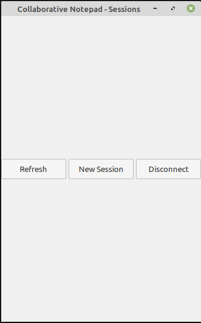
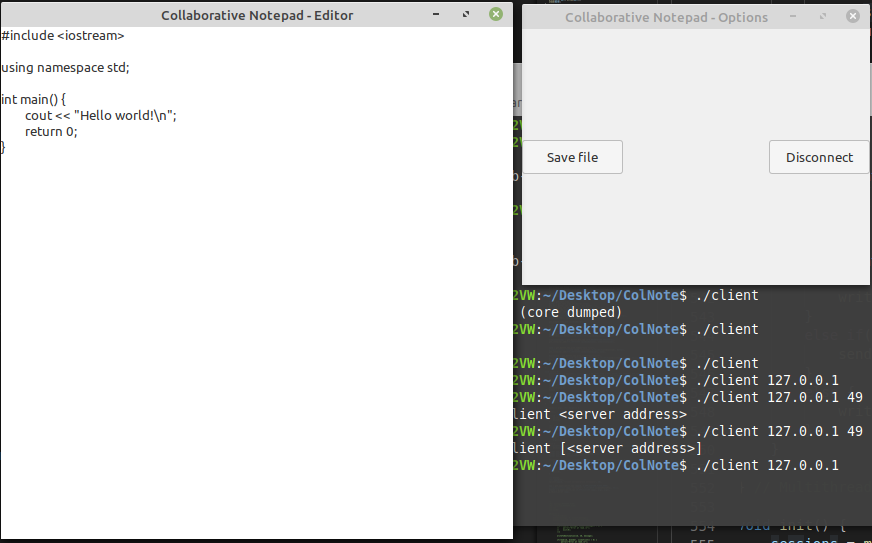

# Introduction

Collaborative Notepad is a program that allows two users to edit a text
document. Each user will have to first connect to the server, and then
they will be able to start editing a new document or join other users in
editing one. The main target for this program is to allow easier
collaboration between project partners, allowing them to simultaneously
write in a single document. They will also be allowed to download that
document, or create a new one if need arises.

## Motivation

There are situations in which people need access to a centralized
document that can be edited by more than one person. Examples of such
circumstances are:

-   A group of two or more students needs to write a report on a school
    project. The project could be composed of more tasks, and the report
    needs to cover all of them. The students, not wanting to waste time,
    divide the tasks between them and each one will start writing in the
    report document their own section. Without a program like the
    collaborative notepad they would have to write in different
    documents and then append them through other means, wasting time.
    Also, if one of them had to change something on their part, they
    would all need to update manually the full document as to take the
    change into consideration.

-   A team is working on an app. Each programmer must code a part of the
    application, each with its own necessities. Assuming that the app
    has a graphical user interface, each programmer will ask the graphic
    designers for different assets. Without using a collaborative
    notepad, the graphic designers wouldn't have a centralized
    requirements list, and they could receive duplicate requests. These
    problems are eliminated when using said program because the
    programmers can read what the others need before submitting their
    own requests and not ask for assets already asked for, thus solving
    the duplicate request problems, and the final list would be in one
    location, in one document, easy to see and to read by the graphic
    designers.

# Technologies

The communication the program will use is based on the Transmission
Control Protocol (**TCP**). This choice was made to ensure a reliable
and ordered transfer of data. Communication between different parts of
the program is frequent, and synchronization between Clients connected
to the same Session is vital. If even only one command between the
Client and the Session (or reversed) gets corrupted on its way then it
can cause major problem for the whole Session.

A constant connection between the member parts of the program is also
very useful because Clients will usually send commands to the Session on
a second basis, since a command is basically any letter written or
erased.

The Sessions will be sub-parts of the Server, a Session being created at
the request of the Client through **fork()**. It will have a Session
port which will be used by the Server and the Clients to send messages
to. The Session will only listen on that port, while sending messages to
the Clients through their descriptors. The Clients' descriptors will be
stored and will be used by the Server or the Sessions to communicate
with them.

Whenever a Client connects to the Server a new thread will be created in
the Server specifically for that Client. Much alike, when a Client is
assigned to a Session, a new thread will be created in that Session, for
communication with that Client.

All messages sent throughout the program will have the following
structure, as to assure consistency:

*[PORT][SIZE][MESSAGE]*

Where *PORT* is the port of the sender, *SIZE* is the size of the
message sent and *MESSAGE* is an array of bytes of size *SIZE*. When
reading a message the following steps will be followed:

1.  Read an integer value, representing the port of the sender.

2.  Read another integer value, representing the size of the message
    sent.

3.  Read an array of bytes equal to the size read. This will be the
    actual message.

The Server will always use the port *49200*. The range of ports assigned
to the Session will be *49201-49300*. Therefore, a maximum of 100
Sessions will be able to exist at one time.

# Program architecture

The whole program will be composed of one Server and several Clients
which will communicate using a certain protocol.

## Core parts

## The Server 

The Server is the most important part of this program. It goes through
two stages throughout its lifetime. First it will start, initializing
needed components and then it will start waiting for Clients. The most
important data structure of the Server is the Session array.

The **Session array** will store the assigned port of each currently
open Session. This will also store each Client connected to a certain
Session, and other information about that Session, such as the name of
the file that is being edited.

## The Session 

Sessions are sub-parts of the Server. When a Client wants to edit a
document, they need to create a Session or join an existing one. They
will then directly interact with their assigned Session. Each Session
will make use of the following:

1.  The **Session port**. This is assigned by the Server when the
    Session is created. This will be used to communicate with the
    Clients or will allow the server to send messages to the Session.

2.  The **opened file**. It will be stored as a char array, and will not
    be changeable.

3.  The **array of Clients**. This array will store the clients assigned
    to the current Session.

## The Client 

The Client is the part of the program used by the user. It will allow
editing text through simple means such as **writing** or **erasing** or
through more complex ones such as **copy**, **cut** and **paste**(Not
yet implemented). A custom graphical interface will be used in order to
properly handle all the events that can occur. Each Client makes use of
only one important value for communication, the **Session port**. This
is assigned to them when they connect to a Session.

## Communication

During execution, communication can occur between the Client and the
Server, between the Server and the Session or between the Session and
the Client.

## Communication between Client and Server

All the communication that is going to take place between the Client and
the Server will start from the former, the latter only responding
accordingly. The Client can do the following:

1.  **Connect**. This will connect the Client to the Server. A unique
    Client ID will be assigned to the Client and they will then be able
    to start editing a document of their choosing.

2.  **Create a new Session**. This will create a new Session and then
    link the Client to it. The Client must choose the document they want
    to edit. The Server will then send them the Session port that they
    will be using.

3.  **Join an existing Session**. This will allow the Client to be
    linked to an already existing Session in order to edit its document.
    The Client must click on the Session they want to join (from the
    Session list in the graphic interface). The Server will either link
    the Client with that Session and provide the port needed for
    communication or respond with an error message (sending a negative
    port which will be interpreted by the Client).

4.  **Disconnect**. The user will leave the program and the Client ID of
    their Client will become once again free for the taking.

## Communication between Server and Session 

The communication between the Server and any Session is limited, and
there are only two cases in which it will happen:

1.  A new Client was assigned to the Session. The Session will receive
    its Client port and update its array. It will not respond in any way
    to the Server.

2.  A Client connected to the Session disconnected. The Server will
    unlink that Client from the Session.

## Communication between Session and Client 

Most of the communication that will happen will be between the Session
and the Client. It will be done through the use of the Session port and
the Client descriptor of each Client. There are multiple interactions
that can happen:

1.  A Client wrote something. This will send a signal to the Session,
    telling what they wrote and where. The Session will then do the
    following:

2.  The Session sends a **write** command towards all the connected
    Clients. The written character and the position will be provided.

3.  A Client erased something. This will send a signal to the Session,
    specifying at which position the operation occurred. The Session
    will then do the following:

4.  The Session sends a **erase** command towards all the connected
    Clients. Only the position will be provided.

When entering a Session, the current text in the document is sent to the
Client. When one Client changes something in the text of the Session it
changes it in the text of all Clients, thus the need of communication
from Session to all Clients. Every Client will execute every command, as
to avoid sending the whole text after each change or making all clients
open the document and read all of it, both of which would be way more
costly (from the point of view of the execution time). The Client also
has access to the following two commands, which will not affect other
Clients:

1.  **Download**. This will download the document that is currently
    edited.

2.  **Change Session**. This will disconnect the Client from the current
    Session. The Session will send a signal to the Server, and remove
    the Client's data from its arrays.

# Conclusions

## Improvements to the base idea of the program

In the base description of the program it is specified that only two
concurrent users are allowed to edit one document at the same time. The
current version of the program, the one derived from the base idea,
allows any number of users to edit any file. The architecture described
in this paper allows such synchronization between any number of clients.

The User Interface(UI) is implemented using Gtk and Glib. It allows the
user to easily create new sessions, see what sessions are currently
running and join one of them. After entering a session, they can easily
write in a custom-made text editor that allows the use of any character,
bar the tab character('\
t') which created many issues, the use of the two common erasing
methods, **backspace** and **delete** and the use of arrows or the mouse
to navigate. The user also has the option to save a file, it being saved
as \"Saved-UserID-initialFileName\".

 | 

## Bugs and Glitches

There are a few known bugs and glitches. These are:

-   If an user writes more than one letter at the same time it may,
    rarely, desynchronize him, his peers and the Session. This is caused
    by the travel time of messages between the clients and the session.

-   Users can select text dragging the mouse while clicked. Erasing or
    writing over that selected text will cause a total desynchronization
    between the Session and that Client. This is caused because text
    selection was not yet handled.

-   If an user writes too fast, the letters introduced by them may be
    handled in reverse order, resulting in the wrong output (For
    example, writing \"ab\" too quickly may cause the Clients to receive
    \"ba\"). This is also caused by the travel time between the Session
    and its Clients, but also by the way Clients handle commands.

## Future Improvements

The first and utmost important improvement that can be made to the
program is bug fixing. The first described bug and the third one can be
solved by implementing some kind of queue of commands on the Client's
side. Another possible solution is modifying the protocol used, as to
include a timestamp for the event. If the Client receives a command from
the Session and they can still read another one, they should read them
both, sort them based on the timestamp and act accordingly. The second
bug is the easiest to fix; text selection must be disabled for the
editor window. These bugs and glitches were not solved in the latest
version due to the need to re-implement the whole protocol, which could
have probably caused other problems, and they will be handled in a
future version.

Another improvement that can be made affects the interaction between a
Client and its Session. Using the described architecture Clients are
limited to simple operations such as **writing** and **erasing**. This
means that keyboard shortcuts such as **CTRL+C (Copy)**, **CTRL+X
(Cut)** and **CTRL+V (Paste)** are not supported. This can be improved
by providing support for them, which should not be a tough task since
the graphical interface is custom-made and these more complex operations
can be reduced to series of basic ones.

Yet another improvement is the option to create files directly from the
file chooser dialog. The Gtk file chooser dialog doesn't allow file
creation, therefore a Client can only open an already existing file.
This is inconvenient because they have to create a new file outside the
program if needed, thus hindering the fluidity of the program. A new
such window would allow user input through an \"Entry\" widget and use
the result accordingly, allowing both creating new files and saving
files with a different name.

Besides these improvements, the speed and reliability of the whole
program could be improved in some aspects with small modifications, thus
further decreasing the desynchronization chances.

## Bibliography

Project information\
Information about the Collaborative Notepad project.
<https://profs.info.uaic.ro/~computernetworks/ProiecteNet2020.php>

TCP vs UDP\
Advantages and disadvantages of both TCP and UDP.
<https://www.geeksforgeeks.org/differences-between-tcp-and-udp/>

List of TCP and UDP ports\
List of used ports and available ports.
<https://en.wikipedia.org/wiki/List_of_TCP_and_UDP_port_numbers>

Select command\
Man page of Select command.
<https://man7.org/linux/man-pages/man2/select.2.html>

Create thread command\
Man page of pthread_create command.
<https://man7.org/linux/man-pages/man3/pthread_create.3.html>

Overleaf, a text editor similar to Collaborative Notepad\
Study on how the writing pointer of different clients should behave when
an event happens. <https://www.overleaf.com/>

Clearing character arrays\
How to clear a character array
<https://stackoverflow.com/questions/1559487/how-to-empty-a-char-array>

Gtk and Glib Information\
How to handle apps created with glib
<https://developer.gnome.org/gio/stable/GApplication.html>\
How to choose an app ID for glib
<https://wiki.gnome.org/HowDoI/ChooseApplicationID>\
Information on how to create a Gtk File Browser
<https://developer.gnome.org/gtk3/stable/GtkFileChooserDialog.html>\
How to create and use a Gtk button box
<https://developer.gnome.org/gtk3/stable/GtkButtonBox.html>\
How to use Gtk containers
<https://developer.gnome.org/gtk3/stable/GtkContainer.html>\
How to add signal listeners to an app with glib
<https://developer.gnome.org/gobject/stable/gobject-The-Base-Object-Type.html>\
Information on Gtk Text buffers
<https://developer.gnome.org/gtk3/stable/GtkTextBuffer.html>\
Keyboard input with Gtk and Glib
<https://developer.gnome.org/gdk3/stable/gdk3-Keyboard-Handling.html>\
Information about Gtk Dialog boxes
<https://developer.gnome.org/gtk3/stable/GtkMessageDialog.html>
:::
